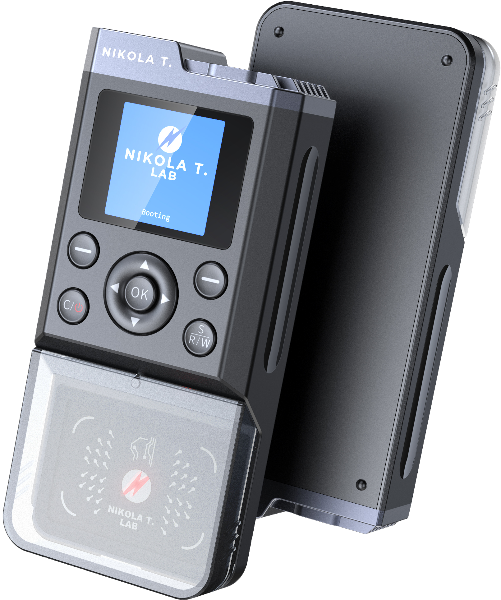
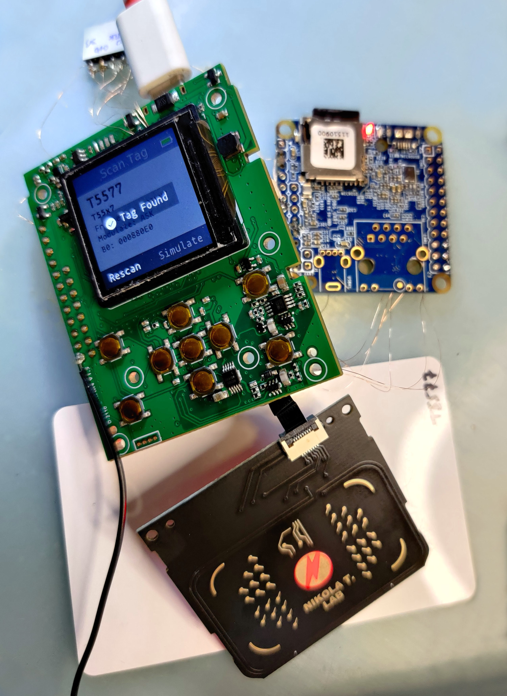

# iCopy-X Teardown, *Ongoing*

Some *ongoing* notes trying to understand what the iCopy-X is made of, what's the current state and what could be done once the software gets fully open-sourced.

 => 

## Official links

Links mentioned in the documentation and in social networks

* [iCopy-X on Facebook](https://www.facebook.com/RFIDiCopyX/)
* [iCopy-X on Twitter](https://twitter.com/icopy_x)
* iCopy-X on WeChat ?? Cannot find it.
* [iCopy-X on Kickstarter](https://www.kickstarter.com/projects/nikola-lab/icopy-x-0)
* https://icopy-x.com/
  * https://www.icopy-x.com/warranty (not yet online as of 06/2021)
  * https://www.icopy-x.com/support (not yet online as of 06/2021)
  * https://www.icopy-x.com/updates a form where you need to provide your serial number as apparently firmwares are diversified per device.
* team@icopy-x.com    => product level
* [Nikola T. Lab Youtube channel](https://www.youtube.com/channel/UCI0js55nP1E7nIMZNaQGqZQ)
* [Nikola T. Lab on TikTok](https://www.tiktok.com/@nikolat.lab)
* [Nikola T. Lab on Twitter](https://twitter.com/LabNikola)
* https://www.nikola-lab.com/ (not yet online as of 06/2021)
  * https://nikola-lab.com/registration
* team@nikola-lab.com => distributorship

## TL;DR

So far, major observations are the following.

iCopy-X is based on Proxmark3 and a NanoPi NEO embedded Linux to run the client side.
It contains an additional Python wrapper to provide a user interface with LCD and buttons.

* Proxmark3 has an external flash like RDV4 but no smartcard reader
* Proxmark3 FPGA is a larger model than usual
* Proxmark3 runs a modified version of RRG/Iceman repo circa September 2020
  * ARM firmware got modified at least to deal with the new FPGA image and to remove version information
  * FPGA image got modified to merge lf, hf and felica images
  * `fpga_compress` got modified to allow larger image (`#define FPGA_CONFIG_SIZE 72864L`)
  * client for NanoPi got modified at least to return error codes and to remove version information
  * client for Windows got modified at least to return error codes and to remove version information

None of the ARM, FGPA and clients source code has been released, which is a violation of their GPL license and disrespectful towards the people who continuously improved the code during last 15 years.

It's quite a pity, because it could be a wonderful tool in the same vein as the RDV4.

## [Hardware](hardware/README.md)

## [Proxmark3](proxmark3/README.md)

## [STM32](stm32/README.md)

## [NanoPi NEO](nanopi-neo/README.md)

## [Software](software/README.md)

## [Operations](operations/README.md)

## [Tags](tags/README.md)

## [Forensics](forensics/README.md)

## Open Questions

* How firmwares are tied to serial numbers? cf version.so
* Are cards really tied to icopy-x? If yes, how?
* Is the antenna LED drivable?
* LED screen drivable by both STM32 and NanoPi?
* Non-PC Mode: is there any usage of /dev/ttyACM0 when untied to ?
* Try extraction of STM32 fw
* Which FPGA is it?

## Desired changes

* Open the source code such that it could be properly maintained up to date with the RRG/Iceman and its GUI maintained properly as well
* Bind the UART-to-USB bridge to the Linux Debug console when in non-PC-Mode, it's much more convenient than using the inner UART1
