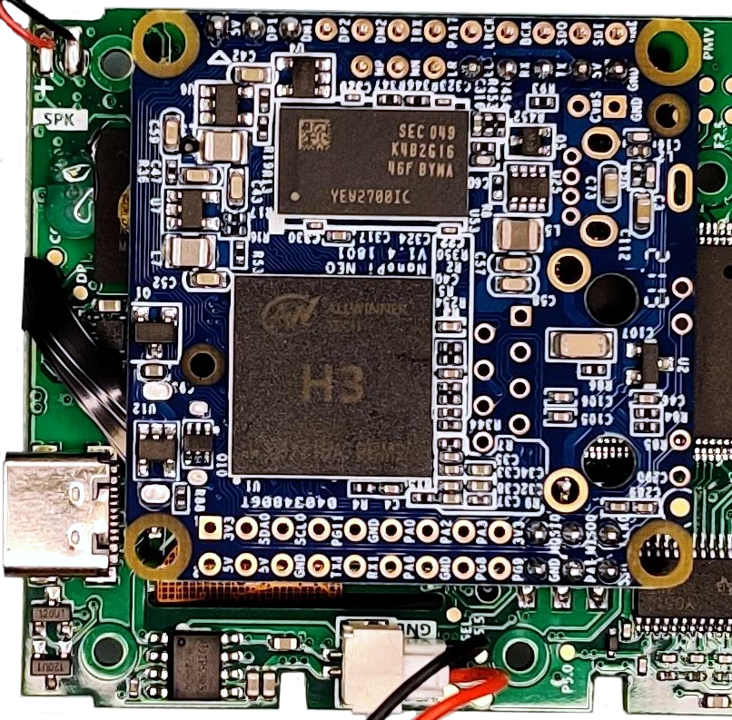
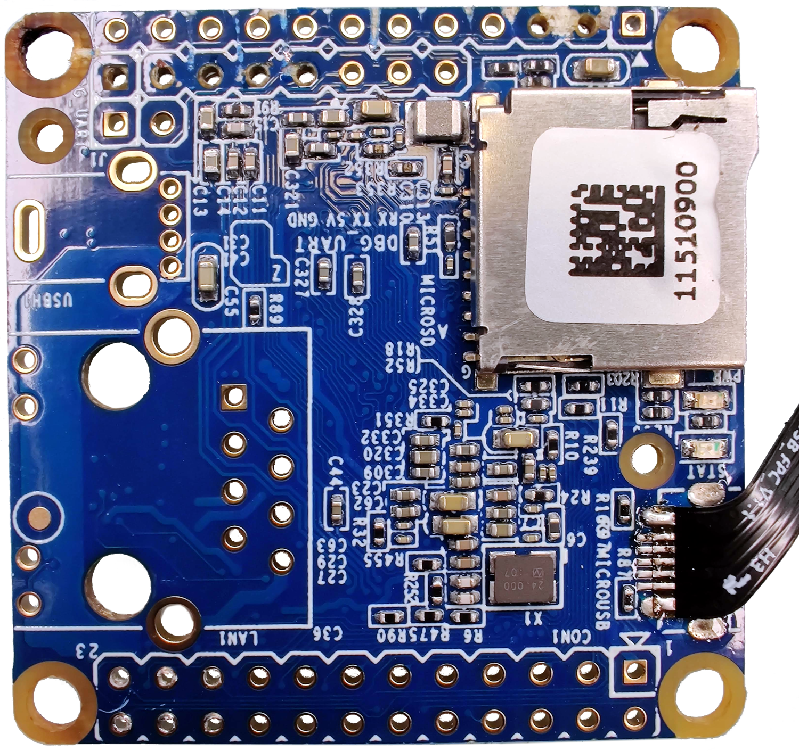
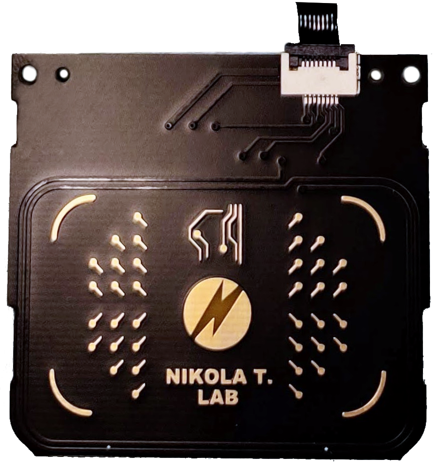
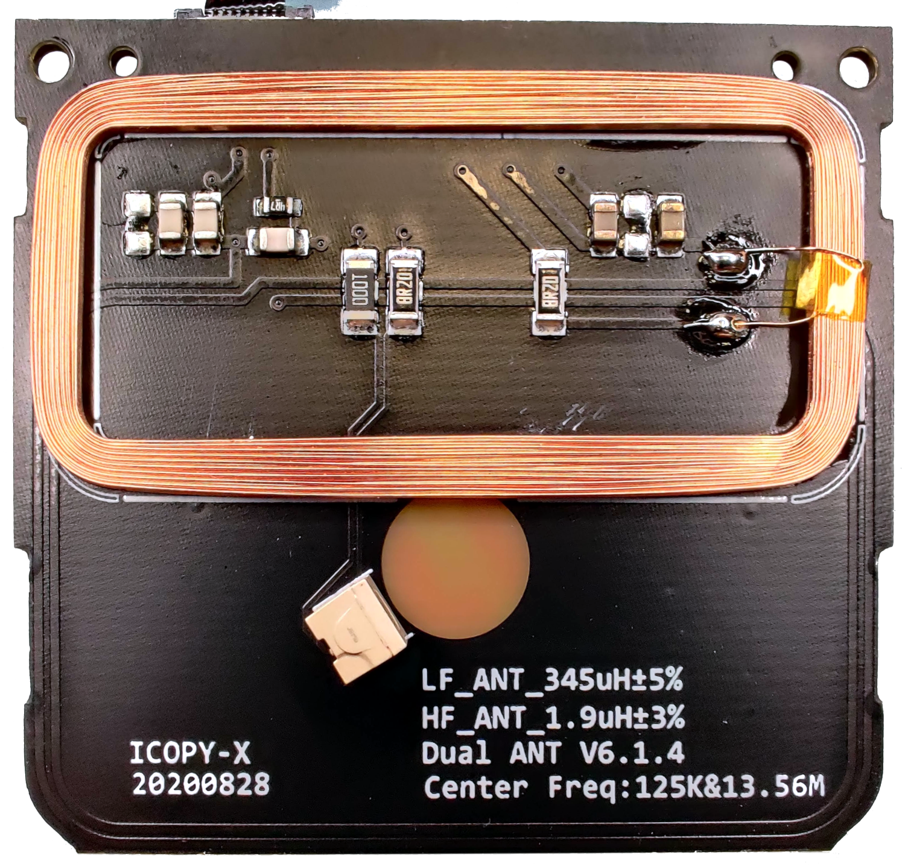
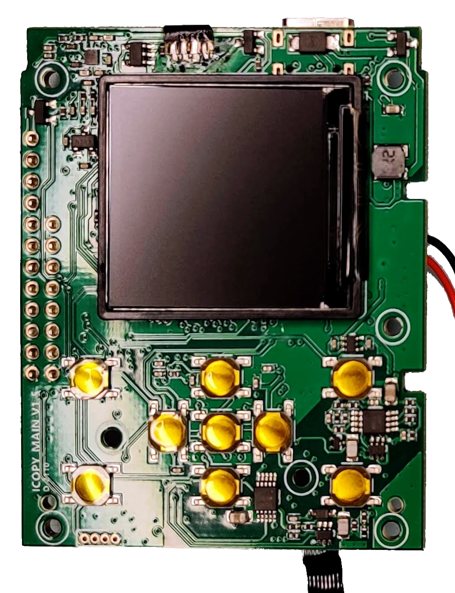
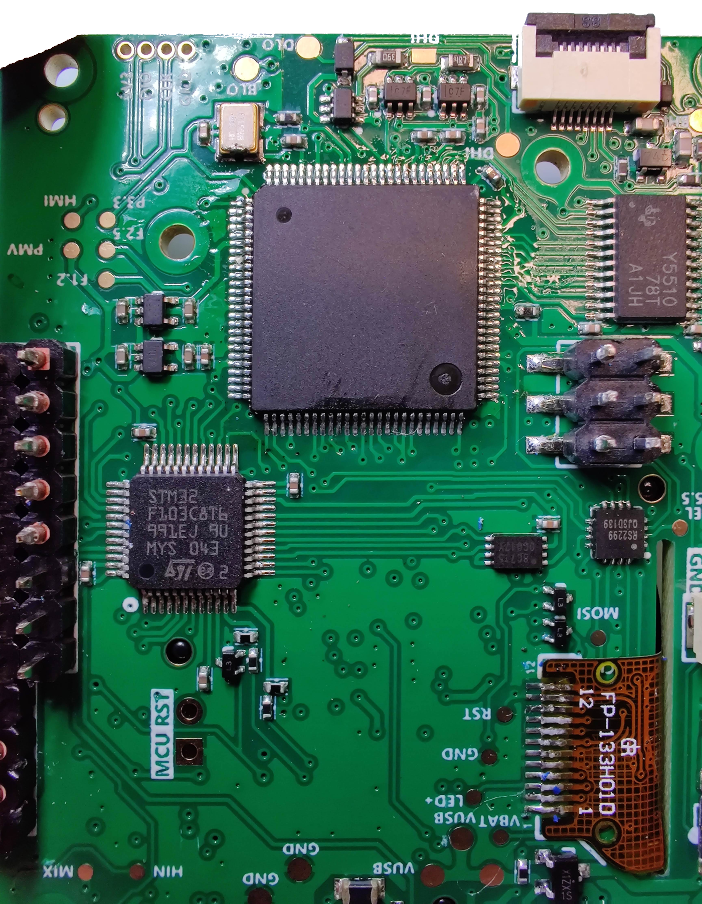

# Hardware

Open it from the top first.

* Casing with a speaker in the top part
* Battery LiPo 604060 3.7V 7.4Wh 2000mAh
* a [NanoPi NEO V1.4](../nanopi-neo/README.md) PCB

* an antenna PCB
  * aspect quite similar to RDV4 antennas
  * red LED visible through PCB
  * `ICOPY-X 20200828`
  * `LF_ANT_345uH±5%`
  * `HF_ANT_1.9uH±3%`
  * `Dual ANT V6.1.4`
  * `Center Freq:125K&13.56M`

* a green multi-function PCB
  * `ICOPY MAIN V1.5 D-2110`
  * Proxmark3
  * USB-C and battery management
  * Speaker driver
  * LCD 1.3'' BL-​133H01B Driver:ST7789 240x240 4-line SPI
    * Seems it can be driven by the STM32 and by the NanoPi
  * Inputs driver
  * STM32F103C8T6, still to figure out

## Interconnections

### Green PCB <> NanoPi NEO

#### NanoPi 20 & 24-pin headers

Actually only 14 pins are used:

|NanoPi NEO|Pm3 ARM7|STM32|Misc|Comment|
|-|-|-|-|-|
|USB1.DM1|56 - DDM|||USB D-|
|USB1.DP1|57 - DDP|||USB D+|
|SPI0.CS|||LED?|?
|SPI0.MOSI0|||LED?|?
|SPI0.MISO0|||LED?|?
|SPI0.CLK0|||LED?|?
|UART0.TX||pin31||?
|UART0.RX||pin30||?
|LL|||Audio amp -> speaker|lineout left
|GND *2|
|5V||||?
|5Vout||||?
|PA1/UART2.RX| |||?

#### 4-pin FPC

For USB connection with the host via the USB-C connector on the green PCB.

### Antenna PCB <> Green PCB

Connected via a 8-pin FPC

## Proxmark3

* AT91SAM7S512
  * JTAG not routed
  * JTAG disabled
* with another unlabeled FPGA, possibly a Spartan 3
* External 256kb Flash
* (no SIM slot)

## STM32F103

See [STM32F103](../stm32/README.md) section.
