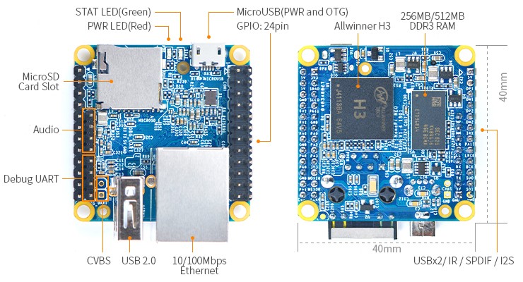
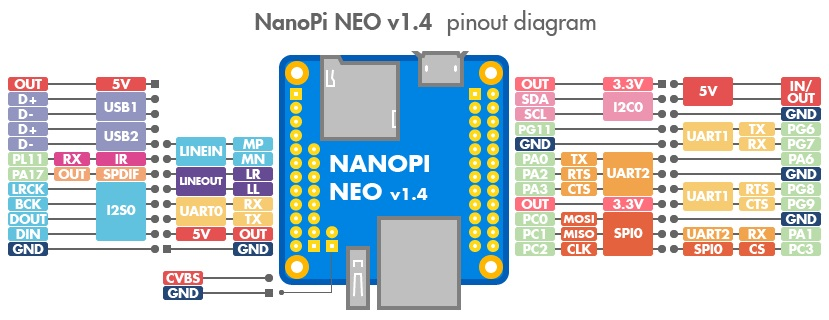

# NanoPi NEO

## Links

* [wiki](https://wiki.friendlyarm.com/wiki/index.php/NanoPi_NEO)
* [NanoPi NEO firmware images and tools](https://drive.google.com/drive/folders/1MngjJtyoJbw91LC_qsL0Pc6ve4aXirGt)





## iCopy-X version

Kind of OEM version without the Ethernet and USB-A connectors.

Advertised as the 256MB version.

## SD Card

```
Units: sectors of 1 * 512 = 512 bytes
Sector size (logical/physical): 512 bytes / 512 bytes
I/O size (minimum/optimal): 512 bytes / 512 bytes
Disklabel type: dos
Disk identifier: 0xcabe25b6

Device     Boot   Start      End  Sectors  Size Id Type
/dev/sda1         49152   131071    81920   40M  b W95 FAT32  => boot (FAT)
/dev/sda2        131072  3612672  3481601  1.7G 83 Linux      => rootfs (ext4)
/dev/sda3       4589568  7802879  3213312  1.5G 83 Linux      => userdata (ext4)
/dev/sda4       7802880 30949375 23146496   11G 83 Linux      => ICOPY-X (FAT)
```

### boot partition

U-Boot

`/dev/mmcblk0p1` on NanoPi NEO

Version comparison:

* U-Boot SPL 2017.11 (Dec 19 2019 - 16:43:16) icode-x
* U-Boot SPL 2017.11 (Apr 25 2021 - 09:46:57) nanopi-neo_sd_friendlycore-xenial_4.14_armhf_20210425

Probably a `nanopi-neo_sd_friendlycore-xenial_4.14_armhf_20191219.img` but that image is not available anymore on the manufacturer site.

Resources:

* https://wiki.friendlyarm.com/wiki/index.php/Building_U-boot_and_Linux_for_H5/H3/H2%2B

### rootfs partition

ext4

rootfs seems to be an out-of-the-box image for NanoPi NEO: *rootfs_friendlycore_4.14* except for kernel modules.

Probably a `nanopi-neo_sd_friendlycore-xenial_4.14_armhf_20191219.img` but that image is not available anymore on the manufacturer site.

Comparison of kernel modules compilation date:
* 19/12/2019 official `rootfs_friendlycore_4.14.tgz`
* 03/12/2020 icode-x
* 25/04/2021 `nanopi-neo_sd_friendlycore-xenial_4.14_armhf_20210425`

### userdata partition

ext4

It implements an overlayfs, so all changes made on `rootfs` are stored separately on `userdata`.

Resources:

* https://github.com/friendlyarm/sd-fuse_h3
* https://wiki.friendlyarm.com/wiki/index.php/How_to_use_overlayfs_on_Linux

TODO what else

### ICOPY-X partition

FAT

This is the exposed partition when iCopy-X is mounted in PC-Mode on the host. In non-PC-mode, it's mounted at `/mnt/upan`.

It contains


* a Windows client for PC-Mode
  * `Backup_of_CLIENT_X86.zip`
  * `CLIENT_X86/`
  * `run.bat`
* a Windows client specific for hardnested attack
  * `Backup_of_AUTO-Hardnest.zip`
  * `AUTO-Hardnest.exe`
  * `Skins/Office2007 Black.asz` ?
  * `Client.{20D04FE0-3AEA-1069-A2D8-08002B30309D}/`, another Windows client for Proxmark3
* `dump/`
* `keys/mf1/mf_user_key.dic`
* a file to update the application following the naming convention `01234567.ipk` where `01234567` is the numeric serial number of the device printed on the back.

See [Software](../software/README.md) section.

