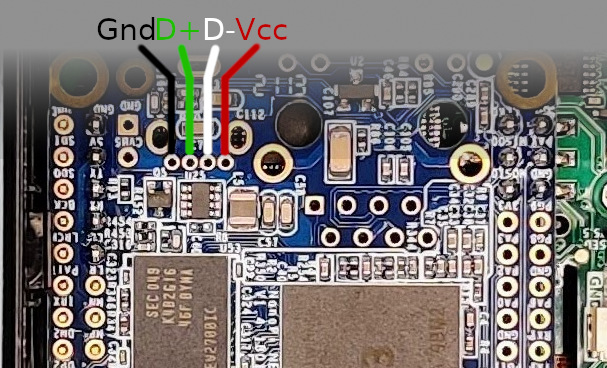
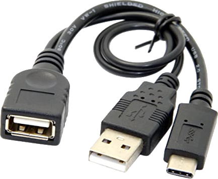

# Networking

## Internal USB socket

One can add a USB-A female socket wired to the NanoPi NEO and use it to plug network adapters.



Tested with a RT2870 dongle.


## USB-C OTG

The iCopy-X USB-C port has OTG support so one can directly plug a network adapter without opening the iCopy-X!

It's easier to just use an Ethernet dongle at first as it doesn't require messing with the firmware update mechanism to configure a Wi-Fi interface without access to UART1.

I had many USB instabilities when using OTG, possibly due to my rewiring of the FPC between green PCB & NanoPi.

Using a USB-C Y-cable and an external power supply solved all these issues (and allows to charge the iCopy-X as well...).



So, in short, to root the device without opening it, use an Ethernet dongle on the USB-C interface, possibly with a Y-cable and extra power supply. Then SSH on the allocated IP address.

## Ethernet

Cheap USB-Ethernet dongles based on Realtek RTL8153 or ASIX AX88772A work fine.

I believe soldering an Ethernet female socket on the NanoPi NEO Ethernet pinouts would work too.

## Wi-Fi

See [here](https://wiki.friendlyarm.com/wiki/index.php/NanoPi_NEO#USB_WiFi) which Wi-Fi chipsets are working out of the box and how to use Network Manager from the command line.

```
nmcli dev
nmcli dev wifi
nmcli dev wifi connect "SSID" password "PASSWORD"
# or: nmcli dev wifi connect "SSID" password "PASSWORD" ifname <wifi_interface_name>
```

## Replacing NanoPi NEO by NanoPi NEO Air

A more radical move done by @gator96100 is to replace entirely the NanoPi NEO by the Air version, embedding a Wi-Fi module.

*Details will come soon*.
