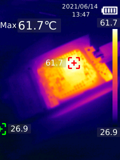
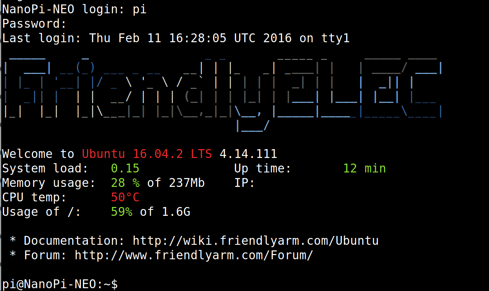
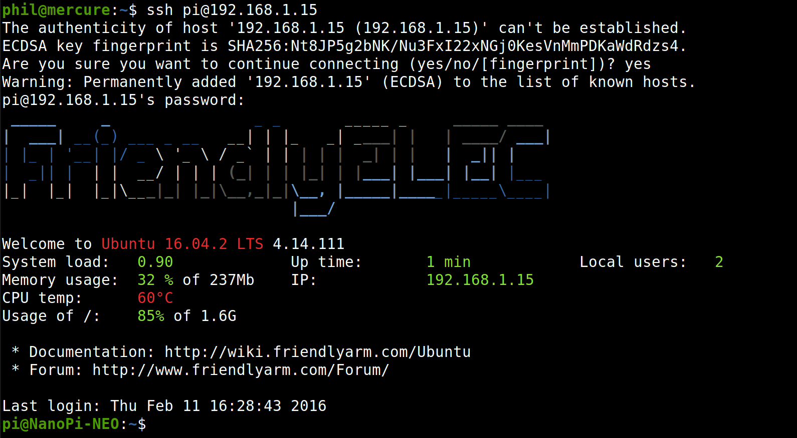

# Operations

## Proxmark3 antennas

* `lf tune`: 46V
* `hf tune`: 37V

## Power Consumption

Consumption measured over the 5V USB-C

* 325mA when idle and not charging the battery
* 411mA `lf tune`
* 450mA `hf tune`

## Temperature

H3 on NanoPi NEO and LCD become quite hot...

### NanoPi H3



### iCopy-X LCD


## Upgrade

Official way to upgrade is

* Get the serial written on the device, e.g. 01234567
* Email it to team@icopy-x.com or fill it in https://www.icopy-x.com/updates and get back a `01234567.ipk` file.
* Set the device into PC-Mode, connect to a PC and drop `01234567.ipk` at the root
* Go to About / Go down to next page / Update firmware

This will update the Python frontend and the proxmark3 client running on the NanoPi NEO.

It is maybe possible to upgrade the internal Proxmark3 (ARM, FPGA) in PC-Mode via the exposed com port as usual.

Beware proxmark3 client, firmware and FPGA image are all specific versions, don't use RRG/Iceman on them.

## non PC-Mode

```
usb 1-2.3: New USB device found, idVendor=0525, idProduct=a4a5, bcdDevice= 4.14
usb 1-2.3: New USB device strings: Mfr=3, Product=4, SerialNumber=0
usb 1-2.3: Product: Mass Storage Gadget
usb 1-2.3: Manufacturer: Linux 4.14.111 with musb-hdrc
usb-storage 1-2.3:1.0: USB Mass Storage device detected
usb-storage 1-2.3:1.0: Quirks match for vid 0525 pid a4a5: 10000
scsi host2: usb-storage 1-2.3:1.0
usbcore: registered new interface driver usb-storage
usbcore: registered new interface driver uas
scsi 2:0:0:0: Direct-Access     Linux    File-Stor Gadget 0414 PQ: 0 ANSI: 2
scsi 2:0:0:0: Attached scsi generic sg0 type 0
sd 2:0:0:0: Power-on or device reset occurred
sd 2:0:0:0: [sda] 81920 512-byte logical blocks: (41.9 MB/40.0 MiB)
sd 2:0:0:0: [sda] Write Protect is off
sd 2:0:0:0: [sda] Mode Sense: 0f 00 00 00
sd 2:0:0:0: [sda] Write cache: enabled, read cache: enabled, doesn't support DPO or FUA
 sda:
sd 2:0:0:0: [sda] Attached SCSI disk
usb 1-2.3: USB disconnect, device number 36
sd 2:0:0:0: [sda] Synchronizing SCSI cache
sd 2:0:0:0: [sda] Synchronize Cache(10) failed: Result: hostbyte=DID_NO_CONNECT driverbyte=DRIVER_OK
usb 1-2.3: new high-speed USB device number 37 using xhci_hcd
usb 1-2.3: New USB device found, idVendor=0525, idProduct=a4a7, bcdDevice= 4.14
usb 1-2.3: New USB device strings: Mfr=1, Product=2, SerialNumber=0
usb 1-2.3: Product: Gadget Serial v2.4
usb 1-2.3: Manufacturer: Linux 4.14.111 with musb-hdrc
cdc_acm 1-2.3:2.0: ttyACM0: USB ACM device
```

So it appears briefly as Mass Storage under VID/PID 0525:a4a5 then as UART bridge under VID/PID 0525:a4a7

## Interface

On some screens, e.g. when reading a tag, Proxmark3 console output can be displayed by pressing *Right* button. Font size can be modified by pressing the 2 top unlabeled buttons.

## PC-Mode

```
usb 1-2.3: New USB device found, idVendor=1d6b, idProduct=0106, bcdDevice= 4.14
usb 1-2.3: New USB device strings: Mfr=3, Product=4, SerialNumber=0
usb 1-2.3: Product: Composite Gadget (ACM + MS)
usb 1-2.3: Manufacturer: Linux 4.14.111 with musb-hdrc
cdc_acm 1-2.3:1.0: ttyACM0: USB ACM device
usb-storage 1-2.3:1.2: USB Mass Storage device detected
scsi host2: usb-storage 1-2.3:1.2
scsi 2:0:0:0: Direct-Access     Linux    File-Stor Gadget 0414 PQ: 0 ANSI: 2
sd 2:0:0:0: Attached scsi generic sg0 type 0
sd 2:0:0:0: Power-on or device reset occurred
sd 2:0:0:0: [sda] 23146496 512-byte logical blocks: (11.9 GB/11.0 GiB)
sd 2:0:0:0: [sda] Write Protect is off
sd 2:0:0:0: [sda] Mode Sense: 0f 00 00 00
sd 2:0:0:0: [sda] Write cache: enabled, read cache: enabled, doesn't support DPO or FUA
 sda:
sd 2:0:0:0: [sda] Attached SCSI removable disk
```

Mass Storage makes ICOPY-X partition visible.

`/dev/ttyACM0` allows to communicate directly with the Proxmark3. It is twice slower than a regular Proxmark3.
It goes via a `socat` bridge in the NanoPi NEO:

```
/bin/sh -c sudo socat /dev/ttyGS0,raw,echo=0 /dev/ttyACM0,raw,echo=0
```

It is not identified as a Proxmark3 so if you're using another client than their official one, you can't use the `pm3` script but you have to tell explicitly your client to use the right port, cf [Compiling our client](../proxmark3/README.md#compiling-our-client) section.

## UART1

### Connect

On NanoPi NEO pins rx1 and tx1 (UART1 3v3) at 115200 bauds, the Debug console is available (pi/pi, fa/fa and root/fa, sudo is also available)



Internally, it corresponds to `/dev/ttyS1`

## Boot & Shutdown

cf [boot.log](boot.log) and [shutdown.log](shutdown.log)

```
cat /proc/cmdline 
console=ttyS1,115200 earlyprintk root=/dev/mmcblk0p2 rootfstype=ext4 rw rootwait fsck.repair=yes panic=10 fbcon=map:0  data=/dev/mmcblk0p3 snd-soc-core.pmdown_time=3600000
```

## Mount
physical partitions:
```
/dev/mmcblk0p1 on /boot type vfat (rw,relatime,fmask=0022,dmask=0022,codepage=437,iocharset=ascii,shortname=mixed,utf8,errors=remount-ro)
overlay on / type overlay (rw,relatime,lowerdir=/root,upperdir=/data/root,workdir=/data/work)
/dev/mmcblk0p4 on /mnt/upan type vfat (rw,relatime,fmask=0022,dmask=0022,codepage=437,iocharset=ascii,shortname=mixed,utf8,errors=remount-ro)
```
## Processes
```
/usr/bin/sudo /usr/bin/xinit /etc/icopy.d/ipk_starter.py
/bin/sh -c sudo /home/pi/ipk_app_main/app.py
/bin/sh -c sudo -s /home/pi/ipk_app_main/pm3/proxmark3 /dev/ttyACM0 -w --flush
```
## Explore app.py

```python
$ python3 -i
>>> import sys, inspect
>>> sys.path.append("main")
>>> sys.path.append("lib")

>>> from lib import version
>>> version.SERIAL_NUMBER
'12345678'
>>> version.getSN()
'12345678'
>>> version.UID
... Some 78 base64-encoded bytes

>>> from lib import commons
>>> commons.getFlashID()
****************************************************************
开始执行命令 b'Nikola.D.CMD = mem info\r\n'
命令发送成功，开始进入接收
检测到通信结束协议字符，通信完成: 

[=] --- Flash memory Information ---------
... Dump of the "mem info" command execution on Proxmark3

命令执行时间(ms):  97.3889729976654
执行命令完成
****************************************************************
'0102030405060708'

>>> commons.startPlatformCMD('ls')
app.py main nikola res lib pm3

>>> from lib import games
>>> str(inspect.signature(games.GreedySnake))
"(canvas, block_size=10, default_len=3, default_xy=(28, 129), default_border=(4, 40, 240, 240), default_direction='UP')"
```

## Install packages

```
apt-cache show strace | egrep '(Depends|Filename)'
Depends: libc6 (>= 2.15)
Filename: pool/main/s/strace/strace_4.11-1ubuntu3_armhf.deb
# Now from host:
# wget http://ports.ubuntu.com/pool/main/s/strace/strace_4.11-1ubuntu3_armhf.deb
# => ICOPY-X
sudo dpkg -i /mnt/upan/packages/strace_4.11-1ubuntu3_armhf.deb

```
## Trace proxmark3 calls

First install strace as seen above

```
strace -p$(pgrep proxmark3) -s9999 -e write|sed -u 's/^[^"]*"//;s/"[^"]*$//;s/\\n$//;s/\\n/\n/g;s/\\t/\t/g;s/\\r/\r/g'
strace: Process 1234 attached
```
Now whenever `app.py` executes commands with the `proxmark3` client, we'll see them as if it was our client.
```
[usb|script] pm3 --> hf 14a info

Nikola.D: 0
[usb|script] pm3 --> lf sea

[=] NOTE: some demods output possible binary
[=] if it finds something that looks like a tag
[=] False Positives ARE possible
[=] 
[=] Checking for known tags...
[=] 
[+] Indala - len 64, Raw: a0000000a0002021
[+] Fmt 26 FC: 1 Card: 2 checksum: 01
[+] Possible de-scramble patterns
[+]     Printed     | __0000__ [0x0]
[+]     Internal ID | 536879137
[+]     Heden-2L    | 320

[+] Valid Indala ID found!

Couldn't identify a chipset

Nikola.D: 0

```

Diagnosis:
```
hf tune
lf tune
lf sea
mem spiffs load f /tmp/test_pm3_mem.nikola o test_pm3_mem.nikola
mem spiffs wipe
```

## Trace /dev/ttyS0

Sniffing RX0 & TX0 with a logic analyzer

```
> FROM_CHG_GO_INTO_MAIN!\r\n
> CHG_PWRON_BAT_VOL 4376!\r\n

<< ! NanoPi NEO communicating at 115200 bauds
< \r\n
< U-Boot SPL 2017.11 (Dec 19 2019 - 16:43:16)\r\n
< DRAM: 256 MiB(408MHz)\r\n
< CPU Freq: 408MHz\r\n
< memory test: 1\r\n
< Pattern 55aa  Writing...Reading...OK\r\n
< Trying to boot from MMC1\r\n
< Boot device: sd\r\n
< \r\n
< \r\n
< U-Boot 2017.11 (Dec 19 2019 - 16:43:16 +0800) Allwinner Technology\r\n
< \r\n
< CPU:   Allwinner H3 (SUN8I 1680)\r\n
< Model: FriendlyElec NanoPi H3\r\n
< DRAM:  256 MiB\r\n
< CPU Freq: 1008MHz\r\n
< MMC:   SUNXI SD/MMC: 0COMMA SUNXI SD/MMC: 1\r\n
< *** Warning - bad CRCCOMMA using default environment\r\n
< \r\n
< In:    serial\r\n
< Out:   serial\r\n
< Err:   serial\r\n
< Net:   No ethernet found.\r\n
< BOARD: nanopi-neo\r\n
< starting USB...\r\n
< No controllers found\r\n
< Hit any key to stop autoboot:  2 \b\b\b 1 \b\b\b 0 \r\n
< reading boot.scr\r\n
< 1478 bytes read in 18 ms (80.1 KiB/s)\r\n
< ## Executing script at 43100000\r\n
< running boot.scr\r\n
< reading uEnv.txt\r\n
< 969 bytes read in 18 ms (51.8 KiB/s)\r\n
< reading zImage\r\n
< 5901432 bytes read in 295 ms (19.1 MiB/s)\r\n
< reading rootfs.cpio.gz\r\n
< 5880768 bytes read in 290 ms (19.3 MiB/s)\r\n
< reading sun8i-h3-nanopi-neo.dtb\r\n
< 34459 bytes read in 25 ms (1.3 MiB/s)\r\n
< overlays is empty\r\n
< reading overlays/sun8i-h3-fixup.scr\r\n
< 4109 bytes read in 33 ms (121.1 KiB/s)\r\n
< ## Executing script at 44500000\r\n
< ## Flattened Device Tree blob at 48000000\r\n
<    Booting using the fdt blob at 0x48000000\r\n
<    Loading Ramdisk to 49a64000COMMA end 49fffbc0 ... OK\r\n
<    reserving fdt memory region: addr=48000000 size=6e000\r\n
<    Loading Device Tree to 499f3000COMMA end 49a63fff ... OK\r\n
< \r\n
< Starting kernel ...\r\n
< \r\n

<< ! NanoPi NEO communicating at 57600 bauds
< h3start\r\n
> \r\n
> -> CMD ERR, try: help\r\n
> \r\n

< h3start\r\n
> \r\n
> -> OK\r\n

< givemelcd\r\n
> \r\n
> -> OK\r\n

< setbaklightBdA\r\n
> \r\n
> -> OK\r\n

< restartpm3\r\n
> \r\n
> -> OK\r\n

< pctbat\r\n
> #batpct:110\r\n
> -> OK\r\n

< charge\r\n
> #charge:1\r\n
> -> OK\r\n

< pctbat\r\n
> #batpct:110\r\n
> -> OK\r\n

< charge\r\n
> #charge:1\r\n
> -> OK\r\n

# Pressing top left and top right button

> KEYM1_PRES!\r\n
> KEYM2_PRES!\r\n

# Pressing directions and OK buttons

> KEYUP_PRES!\r\n
> KEYDOWN_PRES!\r\n
> KEYLEFT_PRES!\r\n
> KEYRIGHT_PRES!\r\n
> KEYOK_PRES!\r\n

# Pressing C/Power and S-R/W buttons

> KEY_PWR_CAN_PRES!\r\n
> KEY_ALL_PRES!\r\n

# Pressing power button long

> KEY_PWR_CAN_PRES!\r\n
> SHUTDOWN H3!\r\n
> ARE YOU OK?\r\n

< giveyoulcd\r\n
> \r\n
> -> OK \r\n

< I'm alive\r\n
> \r\n
> -> OK\r\n

< shutdowning\r\n
> \r\n
> -> OK\r\n
> ARE YOU OK?\r\n
> ARE YOU OK?\r\n
> ARE YOU OK?\r\n
> ARE YOU OK?\r\n
> ARE YOU OK?\r\n
> ARE YOU OK?\r\n
> OK! You are died\r\n
> Prepare to SHUTDOWN!\r\n
> Bye!\r\n
```

Some found commands:

```
charge
fillscreen + param?
fillsquare + param?
givemelcd
giveyoulcd
gotobl
h3start
idid
i'm alive
ledpm3
multicmd + param?
pctbat
plan2shutdown
presspm3
restartpm3
setbaklight + param?
showpicture + param?
showsimbol + param?
showstring + param?
shutdowning
turnoffpm3
turnonpm3
version
volbat
volvcc
```

## Wi-Fi

One can add a USB-A female socket wired to the NanoPi NEO and use it to plug network adapters.


Tested with a RT2870 dongle.



See [here](https://wiki.friendlyarm.com/wiki/index.php/NanoPi_NEO#USB_WiFi) which Wi-Fi chipsets are working out of the box and how to use Network Manager from the command line.

```
nmcli dev
nmcli dev wifi
nmcli dev wifi connect "SSID" password "PASSWORD"
# or: nmcli dev wifi connect "SSID" password "PASSWORD" ifname <wifi_interface_name>
```

Cheap USB-Ethernet dongles based on Realtek RTL8153 or ASIX AX88772A work fine too.

I believe soldering an Ethernet female socket on the NanoPi NEO Ethernet pinouts would work too.
