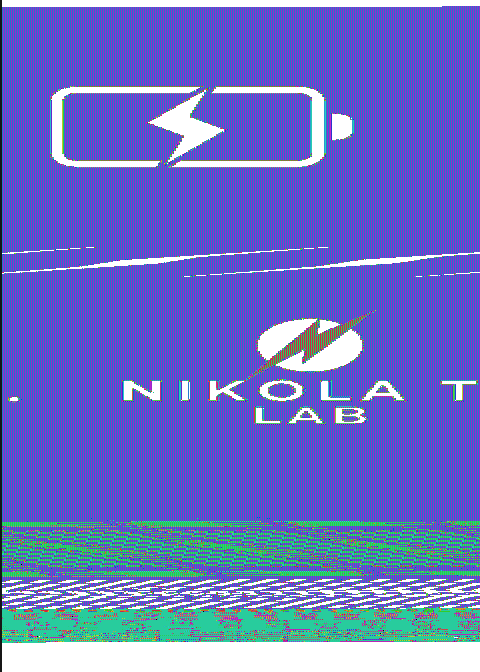

# STM32F103C8T6

## Pinouts

|STM32|Misc|Comment|
|-|-|-|
pin30|NanoPi NEO UART0.RX|
pin31|NanoPi NEO UART0.TX|
pin34|SWD DIO|header
pin37|SWD CLK|header
8,23,35,43,46|GND
9,24,36,48|3v3
todo|

## Protection

In RDP1, SRAM readable via ST-Link/V2

Connect to power via USB-C

Connect ST-Link/V2 via small unpopulated header on green PCB near the antenna: GND, CLK, DIO (don't connect the 3V3)


```
$ st-info --probe
  flash: 26230784 (pagesize: 1024)
   sram: 20480
 chipid: 0x0410
  descr: F1 Medium-density device

$ st-flash read out.bin 0x8000000 0x1904000
st-flash 1.4.0-52-ge059ea7
2021-06-06T16:07:56 INFO common.c: Loading device parameters....
2021-06-06T16:07:56 INFO common.c: Device connected is: F1 Medium-density device, id 0x20036410
2021-06-06T16:07:56 INFO common.c: SRAM size: 0x5000 bytes (20 KiB), Flash: 0x1904000 bytes (25616 KiB) in pages of 1024 bytes

$ st-flash read sram.bin 0x20000000 0x5000
```

* [sram_0x20000000_0x5000.bin](sram_0x20000000_0x5000.bin)

## Partial firmware dump

Thanks @gheilles and @virtualabs for the discussions and help on this part!

Using attack [Exception(al) Failure - Breaking the STM32F1 Read-Out Protection](https://blog.zapb.de/stm32f1-exceptional-failure/), it's possible to extract about 89% of the firmware.

* [flash_0x08000000_0x10000.bin](flash_0x08000000_0x10000.bin)
* [flash_0x08000000_0x10000.bin.asm](flash_0x08000000_0x10000.bin.asm)
* [flash_0x08000000_0x10000.bin.c](flash_0x08000000_0x10000.bin.c)

Note that by the nature of the attack, the firmware is not complete and some words are not extractible, so the asm and decompiled c are purely informative and are incomplete/wrong.

The firmware contains strings like "W25QXX Error!", referring to some external EEPROM chip.

## W25Q80

So a closer look of the green PCB allowed to spot a "8C715" wired to STM32 SPI1 in a way matching W25Q chips:

|W25Q|8C715|STM32|STM32 functions
|-|-|-|-|
|/cs|1|20|PB2
|DO |2|16|PA6 = SPI1_MISO
|/WP|3|22|PB11
|GND|4|GND|
|DI |5|17|PA7 = SPI1_MOSI
|CLK|6|15|PA5 = SPI1_SCK
|/H |7|22|PB11
|Vcc|8|22|PB11


@gator96100 identified it as a W25Q80BLUXIG 8Mbit.

Wiring it in-place to a CH341a via some DIP8 breakout (skipping /H as it's wired to Vcc)

```
ch341prog -r w25q80.bin
Device reported its revision [4.03]
Manufacturer ID: ef
Memory Type: 4014
No CFI structure found, trying to get capacity from device ID. Set manually if detection fails.
Capacity: 14
Chip capacity is 1048576 bytes
Read started!
```

* [w25q80.bin](w25q80.bin)

Using my [ElectronicColoringBook.py](https://doegox.github.io/ElectronicColoringBook/) on it reveals it contains the charging and booting screens (and probably animation):

```
./ElectronicColoringBook.py -c255 -b1 -x 480 -o 200 w25q80.bin
```


