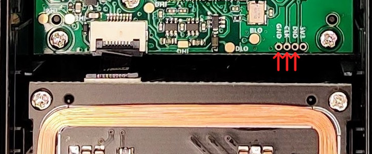

# STM32F103C8T6

## Pinouts

|STM32|Misc|Comment|
|-|-|-|
pin30|NanoPi NEO UART0.RX|
pin31|NanoPi NEO UART0.TX|
pin34|SWD DIO|header
pin37|SWD CLK|header
8,23,35,43,46|GND
9,24,36,48|3v3
todo|

## Protection

In RDP1, SRAM readable via ST-Link/V2

Connect to power via USB-C

Connect ST-Link/V2 via small unpopulated header on green PCB near the antenna: GND, CLK, DIO (don't connect the 3V3)



```
$ st-info --probe
  flash: 26230784 (pagesize: 1024)
   sram: 20480
 chipid: 0x0410
  descr: F1 Medium-density device

$ st-flash read out.bin 0x8000000 0x1904000
st-flash 1.4.0-52-ge059ea7
2021-06-06T16:07:56 INFO common.c: Loading device parameters....
2021-06-06T16:07:56 INFO common.c: Device connected is: F1 Medium-density device, id 0x20036410
2021-06-06T16:07:56 INFO common.c: SRAM size: 0x5000 bytes (20 KiB), Flash: 0x1904000 bytes (25616 KiB) in pages of 1024 bytes

$ st-flash read sram.bin 0x20000000 0x5000
```

* [sram_0x20000000_0x5000.bin](sram_0x20000000_0x5000.bin)

## Partial firmware dump

Thanks @gheilles and @virtualabs for the discussions and help on this part!

Using attack [Exception(al) Failure - Breaking the STM32F1 Read-Out Protection](https://blog.zapb.de/stm32f1-exceptional-failure/), it's possible to extract about 85% of the firmware.

* [flash_0x08000000_0x10000.bin](flash_0x08000000_0x10000.bin)
* [flash_0x08000000_0x10000.bin.asm](flash_0x08000000_0x10000.bin.asm)
* [flash_0x08000000_0x10000.bin.c](flash_0x08000000_0x10000.bin.c)

Note that by the nature of the attack, the firmware is not complete and some words are not extractible, so the asm and decompiled c are purely informative and are incomplete/wrong.
